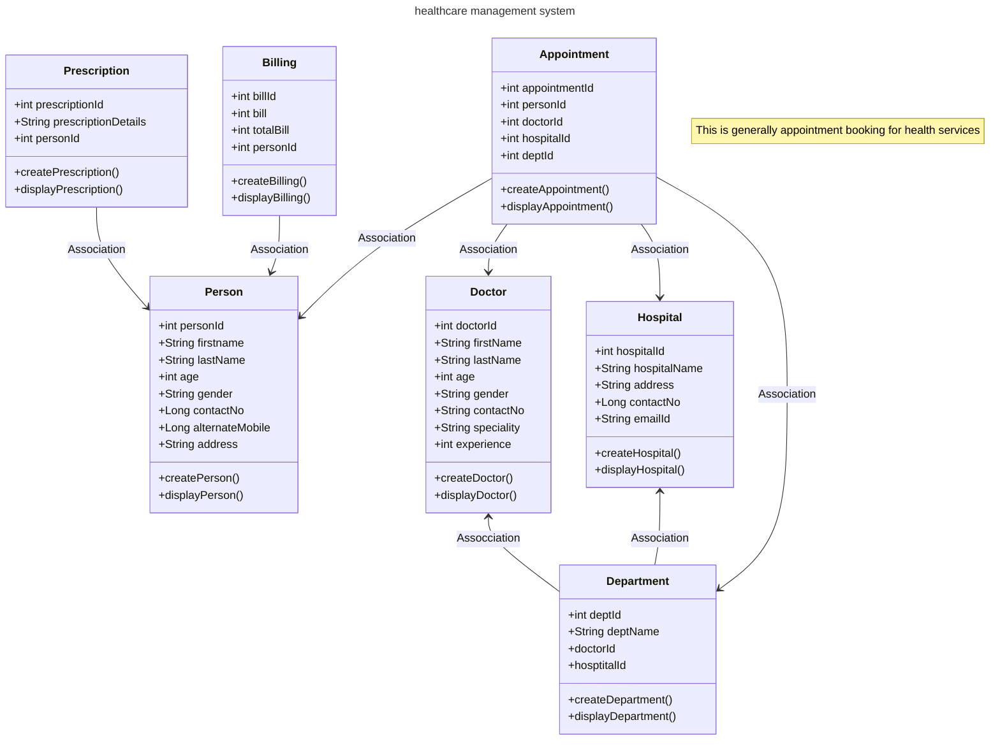

# spring-healthcare-management-system
spring-healthcare-management-system

# Project Overview  
spring-healthcare-management-system project is a basic Java application that demonstrates a healthcare management system. It utilizes object-oriented programming principles and simulates the interactions between patients,doctors and hospitals . It also uses Spring framework.

# Features   
* Manage patient information.
* Manage doctor information.
* Manage hospital information.
* Manage department information.
* Manage appointment information.

# Installation and Setup  
* Prerequisites
* Java Development Kit (JDK) 21.
* An Integrated Development Environment (IDE) such as IntelliJ IDEA or Eclipse.
* Git (optional, for version control).

# Steps
* Clone the repository
* Navigate to the project directory:
* cd spring-healthcare-management-system
* Open the project in your preferred IDE.
* Compile and run the application:
* Locate Main.java.
* Run the file to start the application.

# Package Structure
* com.healthcareApp Contains the main application logic (healthcareApp.java)
* * com.healthcareApp.controller: includes all the controller classes:
  * PersonController.java
  * DoctoController.java
  * HospitalController.java
  * DepartmentController.java
  * AppointmentController.java
  * PrescriptionController.java
  * BillingController.java
* com.helathcareApp.model: includes all the model classes:
  * Person.java
  * Doctor.java
  * Hospital.java
  * Department.java
  * Appointment.java
  * Prescription.java
  * Billing.java
* com.healthcareApp.service: includes all the service classes and interfaces:
   * PersonService.java
   * DoctorService.java
   * HospitalService.java
   * DepartmentService.java
   * AppointmentService.java
   * PrescriptionService.java
   * BillingService.java
   * ConnectionService.java
     
 # Class Diagram

